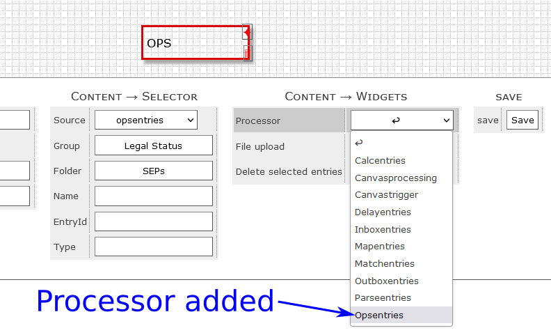
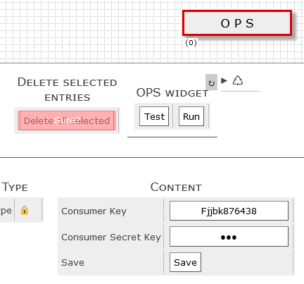

# Datapool Open Patent Service add-on (Processor interface)
The Open Patent Service add-on connects Datapool to the Open Patent Service of the European Patent Office (EPO).
You need to have an account with the EPO to access the service and the account credentials need to be added to Datapool. 
For improved security the account credentials are stored in the setup filespace, i.e. outside of the database.

The Open Patent Service add-on consists of two classes *SourcePot\Ops\OpsEntries* and *SourcePot\Ops\OpsServices*.
*SourcePot\Ops\OpsEntries* is the processor which is instantiated by Datapools *Root.php*.
*SourcePot\Ops\OpsEntries* creates and uses instance *SourcePot\Ops\OpsServices* which contains all methods required to communicate with the OPS.

## How is the OPS add-on used?
If the add-on is installed, the class *SourcePot\Ops\OpsEntries* can be selected as processor within the DataExplorer of Datapool.
The processor runs on a selected subset of data of a Datapool database table. 

In order to connect the add-on with the Open Pantent Service the user credentials of the EPO account need to be added in the DataExplorer.
To do this, just select a DataExplorer item which uses the *Opsentries processor*.

## Setting-up a testpage
1. Run composer ``composer create-project sourcepot/ops {add your target directory here}`` on your server. This will create among other things the **../www/**-subdirectory, which is the document root and 
2. Create the database and a database user, e.g. a user and database named "webpage".
3. Set the database collation to **utf8_unicode_ci**.
4. Call the webpage through a web browser. This will create an error message since the database access needs to be set up. Check the error log which can be found in the **../debugging/**-subdirectory.  Each error generates a JSON-file containing the error details. Calling the webpage also creates the file **../setup/Database/connect.json** which contains the database access credentials. Use a text editor to update or match the credentials with the database user credentials. 
5. Refresh the webpage. This will create an initial admin user account. The user credentials of this account can be found in **../setup/User/initAdminAccount.json**.  With the credentials from this file you should be able the login for the first time.
