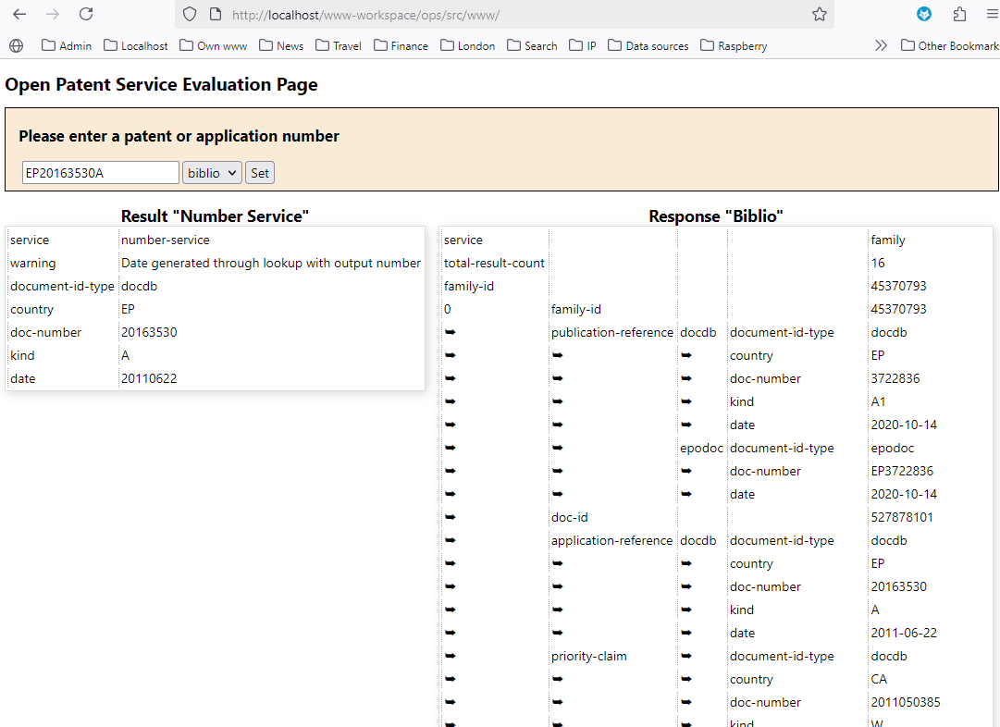

# Bridge to the Open Patent Service of the European Patent Office (EPO)

The Open Patent Services (OPS) class and interface can be installed on a server by running: `composer create-project sourcepot/ops {add your target directory here}`
OPS is a web service which provides access to the EPO's data. You need to have a user account with the EPO to access the data. 

Link to EPO OPS web page:  https://www.epo.org/en/searching-for-patents/data/web-services/ops

## Sample code

```
// create an ops object using the login credentials
$ops=new ops($credentials['appName'],$credentials['consumerKey'],$credentials['consumerSecretKey']);
```

## Evaluation Web Page

An evaluation web page is provided with this package. Here is a screenshot of the evaluation web page:

